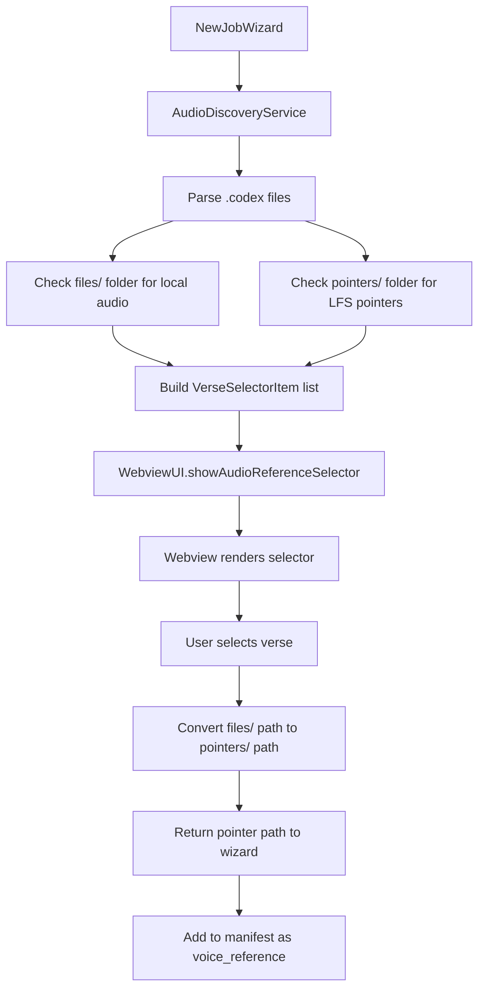

# Reference Audio Selector Design

## Overview

Replace the text input for voice reference selection with an interactive audio selector that allows users to browse, filter, preview, and select reference audio files for TTS inference jobs.

## Problem Statement

Currently, users must manually type the path to a reference audio file, which is error-prone and difficult for non-technical users (especially linguists). The system needs a visual selector similar to the existing verse selector.

## Key Requirements

1. **Show all verses with audio** - Display all verses that have audio metadata (from .codex files)
2. **Filter by reference** - Support text filtering like "MAT", "MAT 1:", "JHN 3:16"
3. **Single selection** - Unlike verse selector, only one audio file can be selected
4. **Audio preview** - Play button to preview audio (only if file exists locally in `files/` folder)
5. **LFS-aware paths** - Output path must use `pointers/` folder for GPU worker compatibility
6. **Optional selection** - Skip button to proceed without selecting reference audio
7. **Reuse existing UI** - Adapt the verse selector component rather than creating from scratch

## Architecture

### Data Flow



### Component Changes

#### 1. AudioDiscoveryService

**Bug Fix:** Currently only checks `files/` folder when `validateFiles: true`. Need to check both `files/` and `pointers/`.

**New Field:** Add `hasLocalAudio` to track if actual audio file exists in `files/` folder (for play button).

```typescript
// In extractVerseFromCell method
let hasAudio = false;
let hasLocalAudio = false;
let audioPath: string | undefined;

if (cell.metadata.attachments && cell.metadata.selectedAudioId) {
    const selectedAudio = cell.metadata.attachments[cell.metadata.selectedAudioId];

    if (selectedAudio && !selectedAudio.isDeleted) {
        const relativeAudioPath = selectedAudio.url; // e.g., ".project/attachments/files/JHN/audio-xxx.webm"

        // Convert to absolute paths for both files and pointers
        const filesPath = path.join(path.dirname(codexFilePath), '..', '..', relativeAudioPath);
        const pointersPath = filesPath.replace('/files/', '/pointers/');

        if (options.validateFiles) {
            // Check both locations
            const filesExists = await fs.access(filesPath).then(() => true).catch(() => false);
            const pointersExists = await fs.access(pointersPath).then(() => true).catch(() => false);

            hasAudio = filesExists || pointersExists;
            hasLocalAudio = filesExists;
        } else {
            hasAudio = true;
            hasLocalAudio = false; // Unknown without validation
        }

        audioPath = relativeAudioPath;
    }
}
```

#### 2. Type Definitions

**src/types/audio.ts:**
```typescript
export interface VerseAudio {
    cellId: string;
    verseRef?: string;
    book?: string;
    chapter?: number;
    verse?: number;
    text: string;
    hasAudio: boolean;
    hasLocalAudio?: boolean;  // NEW: true if file exists in files/ folder
    audioPath?: string;
    audioId?: string;
}
```

**src/types/ui.ts:**
```typescript
export interface VerseSelectorItem {
    cellId: string;
    displayRef: string;
    hasAudio: boolean;
    hasLocalAudio?: boolean;  // NEW: for play button visibility
    audioFilePath?: string;   // NEW: absolute path to files/ folder for playback
}

export interface VerseSelectorOptions {
    phase: string;
    selectionMode: 'include' | 'exclude' | 'single-audio';  // NEW: single-audio mode
    showHideRecorded: boolean;
    showPlayButton?: boolean;  // NEW: whether to show play buttons
    allowSkip?: boolean;       // NEW: whether to show Skip button
}

export interface VerseSelectionResult {
    selectedIds: string[];
    selectedAudioPath?: string;  // NEW: for single-audio mode, the pointer path
}
```

#### 3. Webview UI Component

**src/ui/webview/wizard.js:**

Enhance the `renderVerseSelector` function to support:

1. **Single-selection mode** - When `selectionMode === 'single-audio'`:
   - Hide checkboxes
   - Hide "Select All" and "Deselect All" controls
   - Hide "Hide already recorded" checkbox
   - On row click, immediately respond with selection
   - Show "Skip" button if `allowSkip === true`

2. **Play button** - When `showPlayButton === true`:
   - Add play button column to each row
   - Only show play button if `verse.hasLocalAudio === true`
   - Use HTML5 `<audio>` element for playback
   - Get file URI from extension via message passing

**Play Button Implementation:**
```javascript
// In renderVerseSelector, when building verse elements
if (task.showPlayButton && verse.hasLocalAudio) {
    const playBtn = document.createElement('button');
    playBtn.className = 'verse-play-button';
    playBtn.textContent = '▶';
    playBtn.title = 'Preview audio';

    playBtn.addEventListener('click', (e) => {
        e.stopPropagation(); // Don't trigger row selection
        playAudio(verse.audioFilePath);
    });

    el.appendChild(playBtn);
}

// Audio playback function
function playAudio(filePath) {
    // Request webview URI from extension
    vscode.postMessage({
        type: 'get-audio-uri',
        filePath: filePath
    });
}

// Handle audio URI response
window.addEventListener('message', (event) => {
    const message = event.data;
    if (message.type === 'audio-uri') {
        const audio = new Audio(message.uri);
        audio.play();
    }
});
```

**Single-selection behavior:**
```javascript
// In renderVerseSelector
if (selectionMode === 'single-audio') {
    // Row click selects and closes
    el.addEventListener('click', (e) => {
        if (e.target.classList.contains('verse-play-button')) {
            return; // Don't select when clicking play button
        }

        // Convert files/ path to pointers/ path
        const pointerPath = verse.audioFilePath.replace('/files/', '/pointers/');

        respond({
            selectedIds: [verse.cellId],
            selectedAudioPath: pointerPath
        });
    });
}
```

#### 4. WebviewUI Class

**src/ui/WebviewUI.ts:**

Add new method for audio reference selection:

```typescript
/**
 * Show the audio reference selector.
 * Returns the selected audio path (pointers/ path), or null if skipped, or undefined if canceled.
 */
async showAudioReferenceSelector(
    verses: VerseSelectorItem[]
): Promise<string | null | undefined> {
    const result = await this.askWebview<VerseSelectionResult>({
        taskType: 'verse-selector',
        verses,
        phase: 'Reference Audio',
        selectionMode: 'single-audio',
        showHideRecorded: false,
        showPlayButton: true,
        allowSkip: true
    });

    if (!result) {
        return undefined; // Canceled
    }

    if (result.selectedIds.length === 0) {
        return null; // Skipped
    }

    return result.selectedAudioPath; // Pointer path
}
```

Add message handler for audio URI requests:

```typescript
// In constructor, add to message listener
this.messageDisposable = this.panel.webview.onDidReceiveMessage(
    (msg: WebviewMessage) => {
        // ... existing response/cancel handling ...

        if (msg.type === 'get-audio-uri') {
            // Convert file path to webview URI
            const fileUri = vscode.Uri.file(msg.filePath);
            const webviewUri = this.panel.webview.asWebviewUri(fileUri);
            this.panel.webview.postMessage({
                type: 'audio-uri',
                uri: webviewUri.toString()
            });
        }
    }
);
```

#### 5. NewJobWizard

**src/ui/NewJobWizard.ts:**

Replace the `selectVoiceReference` method:

```typescript
/**
 * Step 6: Select voice reference (optional)
 */
private async selectVoiceReference(ui: WebviewUI): Promise<string | null | undefined> {
    const items: WebviewQuickPickItem[] = [
        {
            label: 'Use Default Voice',
            description: 'No specific voice reference',
        },
        {
            label: 'Select Reference Audio',
            description: 'Choose from recorded verses',
        },
    ];

    const selected = await ui.showQuickPick(items, {
        title: 'Voice Reference',
        placeHolder: 'Use a specific voice reference?',
    });

    if (!selected) { return undefined; }

    if (selected.label === 'Use Default Voice') {
        return null;
    }

    // Get all verses with audio for the selector
    const summary = await this.audioDiscoveryService.discoverAudio({ validateFiles: true });
    const versesWithAudio = summary.verses.filter(v => v.hasAudio);

    if (versesWithAudio.length === 0) {
        vscode.window.showWarningMessage('No audio recordings found for reference selection.');
        return null;
    }

    // Build selector items with local audio info
    const workspaceRoot = vscode.workspace.workspaceFolders?.[0]?.uri.fsPath;
    const selectorItems: VerseSelectorItem[] = versesWithAudio.map(v => {
        let audioFilePath: string | undefined;

        if (v.hasLocalAudio && v.audioPath && workspaceRoot) {
            // Build absolute path to files/ folder for playback
            audioFilePath = path.join(workspaceRoot, v.audioPath);
        }

        return {
            cellId: v.cellId,
            displayRef: v.verseRef || v.cellId,
            hasAudio: v.hasAudio,
            hasLocalAudio: v.hasLocalAudio,
            audioFilePath
        };
    });

    // Show the audio reference selector
    const selectedPath = await ui.showAudioReferenceSelector(selectorItems);

    return selectedPath; // Returns pointer path, null (skipped), or undefined (canceled)
}
```

#### 6. Path Conversion Utility

The path conversion from `files/` to `pointers/` happens in the webview when the user selects an audio file:

```javascript
// In wizard.js, when user selects audio
const pointerPath = verse.audioFilePath.replace('/files/', '/pointers/');
```

This ensures the manifest always gets the pointer path that the GPU worker expects.

## CSS Styling

**src/ui/webview/wizard.css:**

Add styles for play button:

```css
.verse-play-button {
    margin-left: auto;
    padding: 4px 8px;
    background: var(--vscode-button-background);
    color: var(--vscode-button-foreground);
    border: none;
    border-radius: 3px;
    cursor: pointer;
    font-size: 12px;
}

.verse-play-button:hover {
    background: var(--vscode-button-hoverBackground);
}

.verse-play-button:active {
    transform: scale(0.95);
}

/* Adjust verse item layout for play button */
.verse-item {
    display: flex;
    align-items: center;
    gap: 8px;
}

/* Hide controls in single-audio mode */
.verse-selector-single-audio .verse-selector-controls {
    display: none;
}

.verse-selector-single-audio .verse-item input[type="checkbox"] {
    display: none;
}
```

## Testing Plan

1. **Test with local audio files**
   - Verify play button appears and works
   - Verify selection returns correct pointer path
   - Verify Skip button works

2. **Test with LFS pointer-only files**
   - Verify verses appear in list
   - Verify play button does NOT appear
   - Verify selection still works

3. **Test filtering**
   - Filter by book (e.g., "JHN")
   - Filter by chapter (e.g., "JHN 1:")
   - Filter by specific verse (e.g., "JHN 3:16")

4. **Test edge cases**
   - No audio files available
   - Cancel at various points
   - Skip reference selection
   - Select "Use Default Voice"

5. **Test manifest generation**
   - Verify `voice_reference` field uses pointer path
   - Verify path is relative to workspace root
   - Verify path format matches GPU worker expectations

## Migration Notes

- Existing jobs with manually-entered paths will continue to work
- The new selector only affects new job creation
- No database migration needed
- Backward compatible with existing manifest format

## Performance Considerations

- Audio discovery already happens for verse selection, so no additional overhead
- File existence checking (for play button) happens during discovery phase
- HTML5 audio playback is handled by browser, no extension overhead
- Webview URI conversion is fast and cached by VS Code

## Future Enhancements

1. Show audio duration in the list
2. Add waveform visualization
3. Support multiple reference audios for voice mixing
4. Add audio quality indicators
5. Support uploading new reference audio
